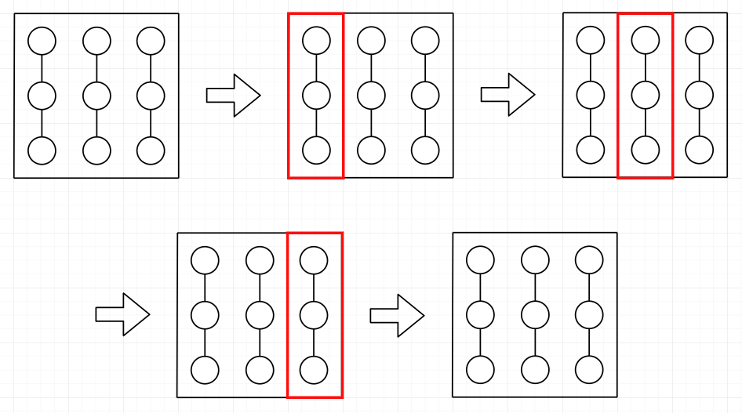

rows 행 columns 열로 나열되어 있는 트랜지스터들이 있습니다. 일부 상하좌우로 인접한 트랜지스터들 사이에는 회로가 연결되어 있습니다. 당신은 이 회로들의 일부분을 잘라내고자 합니다. 회로를 잘라내는 과정은 다음과 같습니다.

임의의 서로 다른 두 트랜지스터를 고른 뒤, 그 두 트랜지스터를 포함하면서 가장 작은 직사각형 영역의 겉테두리와 교차하는 모든 회로를 잘라냅니다.
예를 들어, 다음 그림은 트랜지스터들이 회로로 연결되어 있는 상태에서, 2행 2열과 3행 1열에 있는 두 트랜지스터를 고른 뒤 회로를 잘라내는 과정을 그린 것입니다.

트랜지스터들이 배열된 행의 개수 rows, 열의 개수 columns, 초기 회로 연결상태를 나타내는 2차원 정수배열 connections, 그리고 회로을 잘라낼 영역들을 의미하는 2차원 정수배열 queries가 매개변수로 주어집니다. 매 영역마다 잘라지는 회로의 개수들을 배열에 담아 return 하도록 solution 함수를 완성해주세요.

제한 사항
rows, columns는 각각 2 이상 50 이하인 자연수입니다.
connections의 길이는 1 이상 2 x rows x columns - rows - columns 이하입니다.
connections의 각 원소는 [r1, c1, r2, c2] 4개의 정수로 이루어져 있습니다. 이는 r1행 c1열의 트랜지스터와 r2행 c2열 트랜지스터 사이에 회로가 연결되어 있다는 의미입니다.
r1, r2는 1 이상 rows 이하입니다.
c1, c2는 1 이상 columns 이하입니다.
r1행 c1열과 r2행 c2열은 인접한 두 위치입니다.
모든 회로는 서로 다른 위치에 있습니다.
queries의 길이는 1 이상 100 이하입니다.
queries의 각 원소는 [r1, c1, r2, c2] 4개의 정수로 이루어져 있습니다. 이는 r1행 c1열의 트랜지스터와 r2행 c2열의 트랜지스터를 골라 회로를 잘라야 한다는 의미입니다.
r1, r2는 1 이상 rows 이하입니다.
c1, c2는 1 이상 columns 이하입니다.
두 트랜지스터는 서로 다른 트랜지스터입니다.
입출력 예
rows columns connections queries result
4 3 [[1,1,2,1],[1,2,1,3],[1,3,2,3],[2,2,2,3],[2,2,3,2],[2,3,3,3],[3,2,3,3],[3,2,4,2],[4,1,4,2]] [[2,2,3,1],[1,2,4,2]] [4,2]
2 2 [[1,1,1,2],[2,2,1,2],[2,1,1,1],[2,2,2,1]] [[1,1,2,2],[1,1,2,1],[2,1,2,2]] [0,2,2]
3 3 [[1,1,2,1],[2,1,3,1],[1,2,2,2],[2,2,3,2],[1,3,2,3],[2,3,3,3]] [[1,1,3,1],[1,2,3,2],[1,3,3,3]] [0,0,0]
입출력 예 설명
입출력 예 #1

주어진 입력을 그림으로 표현하면 다음과 같습니다.

처음에는 4개의 회로가 잘라지고, 그 다음에는 2개의 회로가 잘라지므로, [4,2]를 return 해야 합니다.
입출력 예 #2

주어진 입력을 그림으로 표현하면 다음과 같습니다.

처음에는 0개, 그 다음에는 2개, 마지막에도 2개의 회로가 잘라지므로, [0,2,2]를 return 해야 합니다.
입출력 예 #3

주어진 입력을 그림으로 표현하면 다음과 같습니다.

그 어떤 상황에서도 회로가 잘라지지 않았으므로, [0,0,0]을 return 해야 합니다.
