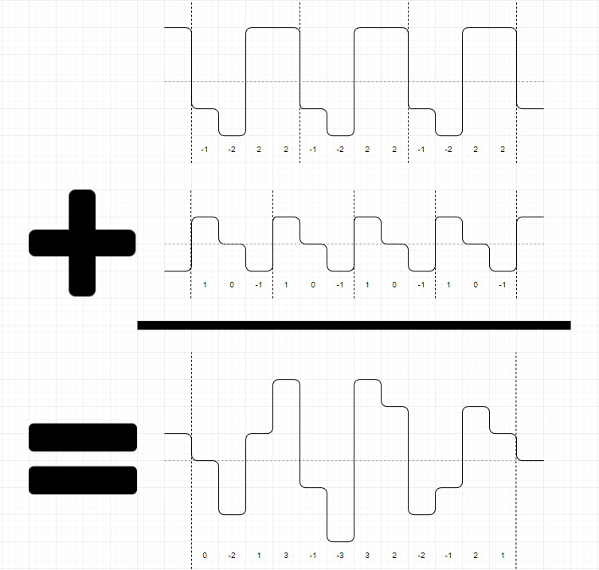
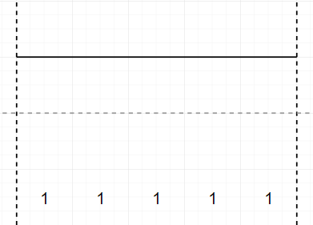
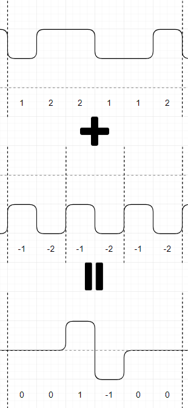
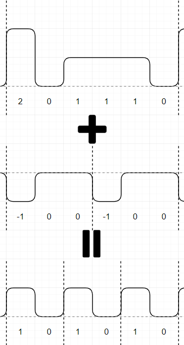

문제 설명
이산적으로 끊어진 파동 데이터가 있습니다. 이 파동 데이터는 일반적인 파동과 마찬가지로 진동하고, 두 파동을 합치는 것이 가능합니다. 단, 이 파동 데이터는 무조건 1초에 1 거리만큼 이동합니다.

예를 들어 다음과 같이 6초의 주기를 가지는 파동 데이터가 있다고 가정합니다. 한 칸의 너비는 1초의 시간을 의미하고, 높이는 1만큼의 파동의 진폭을 의미합니다. 이 파동은 배열 [-1,-2,2,2,0,-1] 또는 [-1,-2,2,2,0,-1,-1,-2,2,2,0,-1] 등으로 표현됩니다.

검은색 실선은 파동을 의미합니다.
검은색 수직 점선은 파동을 주기별로 분류해놓은 것입니다.
회색 수평 점선은 파동의 강도가 0인 지점을 표시해놓은 것입니다.
1초 뒤, 2초 뒤, 3초 뒤 이 파동의 모습은 각각 다음 그림과 같습니다. 참고로, 이 파동은 6초의 주기를 가지고 있기 때문에, 6초가 지난 뒤 파동의 모습은 맨 처음 파동이 가지고 있던 모습과 동일한 모습을 가질 것입니다.

[-1,-2,2,2,0,-1]에 1초의 딜레이를 발생시키면 [-1,-1,-2,2,2,0]과 모습이 같아집니다.

[-1,-2,2,2,0,-1]에 2초의 딜레이를 발생시키면 [0,-1,-1,-2,2,2]와 모습이 같아집니다.

[-1,-2,2,2,0,-1]에 3초의 딜레이를 발생시키면 [2,0,-1,-1,-2,2]와 모습이 같아집니다.
다음 그림은 두 파동이 합쳐지면서 나타나는 하나의 파동을 나타낸 것입니다. 물리학에서와 동일하게 각 지점에서의 두 파동의 진폭을 새로 더하는 방식으로 일어납니다. 이 과정에서 생성되는 새로운 파동은 기존의 두 파동과 비교해서 주기가 길어지거나 짧아질 수 있습니다.

이제 어떤 파동의 진폭분산을 그 파동의 주기 내에서 가지는 진폭들의 제곱의 합으로 정의합니다. 예를 들어, 맨 처음에 예시로 제시된 파동 [-1, -2, 2, 2, 0, -1]의 진폭분산은 (-1)2 + (-2)2 + 22 + 22 + 02 + (-1)2 = 14 입니다.

여기서 주의해야 할 것이 있습니다. 다음 그림과 같이 모든 지점에서 진폭이 같은 상수함수의 형태를 취하는 파동의 진폭분산은 무조건 0으로 취급합니다. 왜냐하면 이 파동은 몇 초가 지나도 항상 동일한 형태를 갖추고 있기 때문에 주기를 측정하는 것이 무의미하기 때문입니다.

이 파동은 [1] 또는 [1,1] 등으로 표현될 수 있지만, 주기는 정의되지 않습니다.
파동 데이터를 표현하는 배열들 wave1와 wave2가 매개변수로 주어집니다. 두 파동 데이터에 적절한 딜레이를 발생시킨 뒤, 둘을 보강/상쇄해서 하나의 파동을 만들었을 때, 해당 파동에서 나타날 수 있는 가장 작은 진폭분산을 구하여 return 하도록 solution 함수를 완성해주세요.

제한사항
wave1의 길이는 1 이상 100 이하입니다.
wave2의 길이는 1 이상 100 이하입니다.
wave1, wave2 안에 들어있는 수들은 모두 -100,000 이상 100,000 이하입니다.
입출력 예
wave1 wave2 result
[1,2,2,1,1,2] [-2,-1] 2
[2,-1,3] [-1,-1] 9
[0,1,1,1,1,1] [0,0,1,0,0,0] 0
[2,0,1,1,1,0] [0,0,-1] 1
입출력 예 설명
입출력 예 #1

wave2가 나타내는 파동을 1초 딜레이시킨 후 합치면 다음 그림과 같은 파동이 나와, 진폭분산이 2인 파동을 얻습니다.

입출력 예 #2

wave2가 나타내는 파동은 모든 지점에서 진폭이 같은 파동이므로, 두 파동에 어떤 시간의 딜레이를 준 뒤 합치더라도 항상 다음 그림과 같은 진폭분산(= 9)을 가진 파동이 나옵니다.

입출력 예 #3

wave1이 나타내는 파동에 2초 딜레이를 준 뒤 둘을 합치면 다음 그림과 같이 모든 지점에서 진폭이 1인 파동을 만들 수 있습니다.

입출력 예 #4

wave2가 나타내는 파동에 1초 딜레이를 준 뒤 둘을 합치면 다음 그림과 같이 진폭분산이 1이면서 동시에 주기가 2로 짧아진 파동을 만들 수 있습니다.

